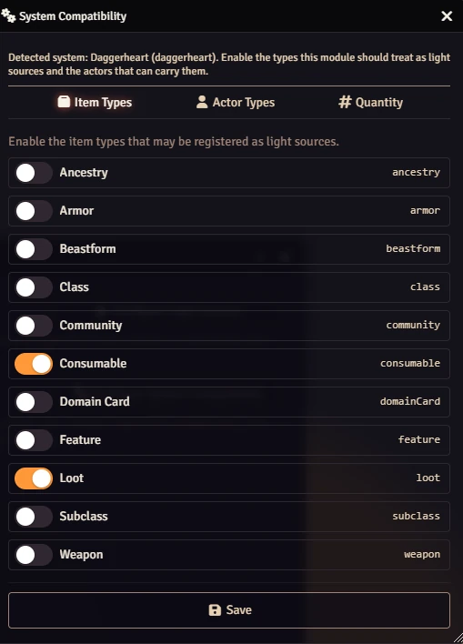
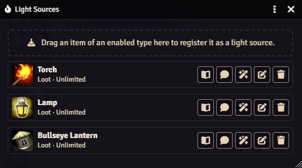
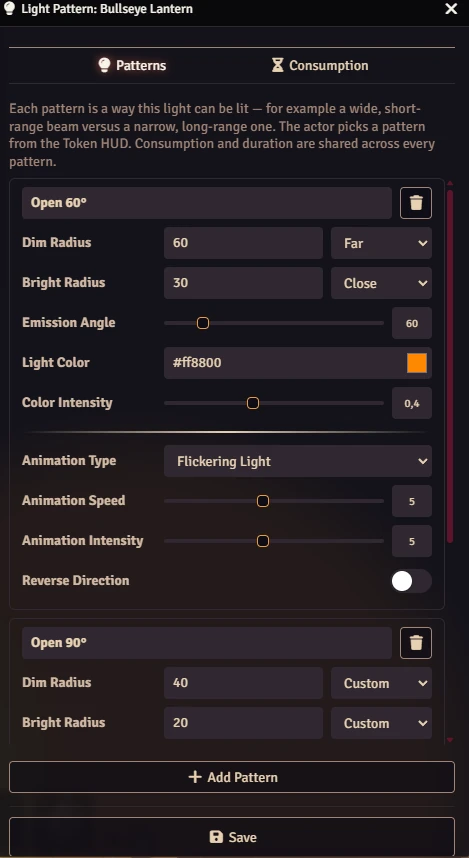
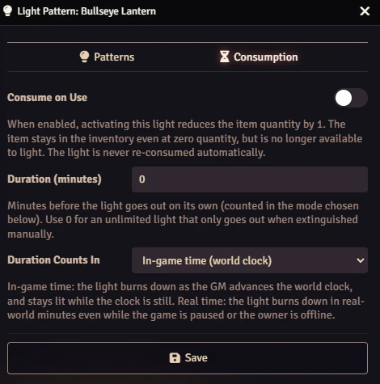
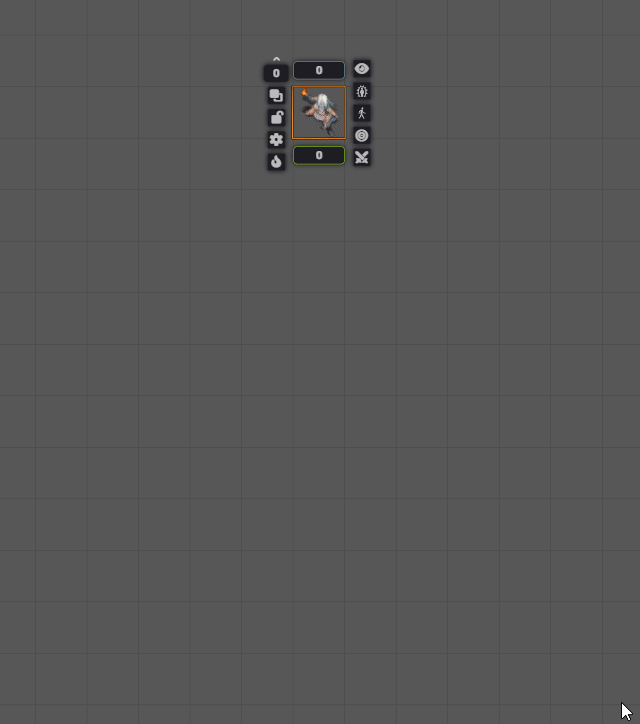
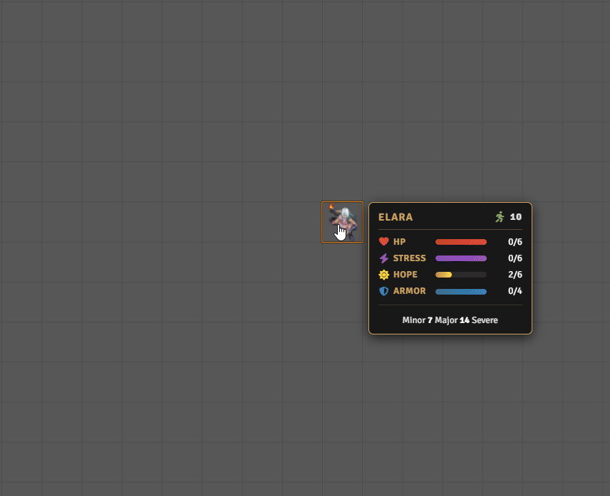

# Light Sources

**Your characters carry torches, candles and lanterns. This module makes them actually light the way — in any system.**

[](https://buymeacoffee.com/mestredigital) [](https://mestredigital.online/pages/projetos-en)

Turn any item in a character's backpack into a real light source. One click on the token, and the darkness pulls back.

## 🕯️ Why?

The party walks into a pitch-black crypt. Someone says *"I light my torch."*

And then the table stops. The GM alt-tabs to the token settings, types a dim radius, types a bright radius, picks a color, picks an animation, closes the window... and by the time the light finally shows up on the map, the moment is gone. Later, nobody remembers to cross the torch off the character sheet, and nobody remembers when it should burn out.

**Light Sources fixes that.** The torch is already in the character's inventory, so lighting it is a single click on the token — the light appears instantly, the item is spent from the sheet, and the flame burns out on its own when its time is up. Darkness stops being paperwork and goes back to being a resource your players have to manage.

## ✨ Key Features

* 🔦 **One-click lighting.** Select a token, click the flame button on the Token HUD, and pick from the light sources available to that character. That's it.
* 🎒 **Uses the real inventory.** Only items the character actually owns show up (plus any "Free for All" sources the GM has enabled — see below). Lighting a torch can subtract it from the sheet, so a torch you burn is a torch you no longer have.
* ⏳ **Lights burn out on their own.** Give a source a duration and it goes out by itself when the time runs out — with a message in chat announcing it. No timers to babysit. Pick how each source counts down: **in-game time** (it burns as the GM advances the world clock — three real hours of chatter won't waste a torch) or **real time** (it burns in real-world minutes even while the game is paused or the player is offline). Hover the flame button on the Token HUD to see what's burning and how much of it is left — no clutter on the map, just the number when you ask for it.
* 🎨 **A look for every flame.** Each source gets its own light pattern: radius, angle, color, brightness and animation. A candle should feel nothing like a bullseye lantern, and here it doesn't.
* 🔀 **Multiple patterns per source.** A single item can have more than one way to shine. A lantern might have a "Low" mode with a soft glow and a "High" mode that fills the room — both appear in the Token HUD, and the player just picks the one they want. Switching between them is free: it reshapes the flame that's already burning, so it never spends a second item and never restarts the countdown.
* 👀 **See it before you save it.** While you edit a light pattern, the change is previewed live on the selected token. Tweak until it looks right — nothing is written until you hit Save.
* 🆓 **Free-for-all lights.** Mark a light source as "Free for All" and every character of an actor type you've enabled can use it, even if they don't carry the item — perfect for magical environmental effects, a bonfire everyone sits around, or a glowing aura that doesn't cost inventory. Regular, item-based sources are never restricted this way: carrying the item is always enough, regardless of actor type.
* ✍️ **Register without an item.** No physical item yet, or want a source that exists by name alone? Click **Add by Name** in the config window to register one instantly — pairs naturally with Free for All.
* 🪔 **Drop a light on the ground.** Light a source, then drop it — the burning light leaves your token and becomes an Ambient Light placed on the map at your token's feet. Walk away, and the torch stays behind on the floor. Dropping costs nothing extra: it puts down the light you already lit. Works even for players; the module relays the request to the GM.
* 🧩 **Works with any system.** Tell the module which item types are light sources, which actor types can use Free-for-All ones, and where an item's quantity lives — then it just works. Daggerheart comes preconfigured out of the box.
* 📏 **Handy presets.** The radius and duration fields come with dropdown presets (10, 15, 20, 30, 60) so you can size a light — or a burn time — in a click instead of typing. Pick **Custom** whenever you want an exact value instead.
* 🗺️ **The light follows the character.** It stays with them across scenes, and blowing it out restores exactly the token lighting they had before.
* 💬 **Chat announcements.** Lighting a source, dropping it on the ground and burning out each post a styled chat card, so the table always knows who has light and who just lost it. Switching between a source's own patterns stays quiet — that's the same flame reshaped, not a new one. You can also send any registered light source to chat as a draggable card — drop it on an actor sheet to add it to their inventory.
* 🔌 **Developer API.** Module and system developers can [programmatically register light sources](docs/register-sources-api.md) from their own code — no manual drag-and-drop needed. Registered sources merge seamlessly with the GM's hand-picked ones.

## 🛠️ How to Use

### For the GM — set it up once

1. Open **Game Settings → Configure Settings → Light Sources → Configure System Compatibility**. Enable the **item types** that count as light sources, the **actor types** allowed to use Free-for-All sources (actors carrying the item can always light it, no matter their type), and enter the **item quantity path** (where your system stores an item's quantity, e.g. `system.quantity`). On Daggerheart this is already filled in for you.

   

2. Open **Configure Light Sources** and drag any item of an enabled type from a compendium or the sidebar into the window to register it — or click **Add by Name** to register a source with just a name, no item required (handy for Free-for-All grants, or for sources you want to set up before the item exists).

   

3. Click the ✏️ pencil on any entry to shape it:
   * **Patterns** — add one or more light patterns for the same item (different radii, colors, animations). A lone pattern needs no name; add a second and each gets its own label in the HUD.

     

   * **Consumption** — whether lighting it uses one up, how many minutes it burns before dying out (`0` = burns forever until put out by hand), and whether that countdown runs on the **in-game clock** or on **real time**.

     

Optional per-source toggles on the config window:
* **Free for All** — when enabled, every actor of an enabled Actor Type can light this source without carrying the item.
* **Send to Chat** — posts a draggable item card that can be dropped onto actor sheets.

There is also one world setting under **Game Settings → Configure Settings → Light Sources**:
* **Allow Dropping Free for All Lights** (on by default) — whether a lit Free-for-All light can be dropped on the ground. No item backs these sources, so dropping one costs nothing and can be repeated without limit; turn this off if you'd rather free lights stayed on tokens. Lights that come from a carried item are always droppable.

Tip: select a token on the canvas while you edit — you'll watch the light change on the map in real time.

### For the players — light it up

1. Make sure the item (a Torch, a Lantern...) is in your character's inventory — however your system normally hands out items. (Skip this if the GM marked the source "Free for All" and your character's type is eligible — then it's available automatically.)
2. Click your token on the map to bring up the Token HUD.
3. Click the 🔥 **flame button** and choose your light source. If the source has multiple patterns, each one shows as a separate option.
4. Done — your token is now lighting the room, and the table sees it in chat.

While something is burning, the flame button glows. Hover it to check what's lit and how many minutes it has left.



To put it out, open the same menu and click **Extinguish Light**. If it burns out on its own first, everyone sees it happen in chat.

**Drop a light**: once a light is burning, a **Drop** button appears next to it in the flame menu. Click it to put that light on the ground as an Ambient Light — useful for torches left behind in a hallway or campfires. Your token goes dark and the light stays where you dropped it. Nothing extra is consumed: you're putting down the light you already lit, not spending a second torch.



## 🔌 For Developers

If you maintain a game system or a companion module and want to ship pre-configured light sources, you can use the **Register Sources API** to add them with code — no GM setup needed.

👉 **[Read the full API documentation](docs/register-sources-api.md)**

Quick taste:

```js
Hooks.once("ready", async () => {
  await game.lightSources?.registerSources([
    {
      uuid: "Compendium.my-system.equipment.Item.torch01",
      patterns: [
        { name: "Standard", light: { dim: 40, bright: 20, color: "#ff8800", animation: { type: "torch", speed: 5, intensity: 5 } } }
      ],
      consume: true,
      durationMode: "world",
      durationMinutes: 60
    }
  ], { managedBy: "my-system" });
});
```

Registered sources appear in the Token HUD and in the GM's configuration window with a badge showing which module manages them.

Registered values are **defaults, not locks**: once the GM edits one of these sources it stops being overwritten, and a **Restore Module Default** control puts it back — either for the whole source, or for a single light pattern. See the [Register Sources API docs](docs/register-sources-api.md#gm-customization-important) for the full contract.

## 🚀 Installation

Install via the Foundry VTT Module browser or use this manifest link:

```
https://raw.githubusercontent.com/brunocalado/light-sources/refs/heads/main/module.json
```

## 🌍 Translations

Want to translate this module? It's easy:
1. Download the `languages/en.json` file.
2. Translate the values in the JSON file.
3. Open an issue on [GitHub](https://github.com/brunocalado/light-sources/issues).
4. Attach your translated file and tell us the `lang` and `name` it should use. For example:
   ```json
   "lang": "en",
   "name": "English"
   ```
   or
   ```json
   "lang": "pt-BR",
   "name": "Portuguese (Brasil)"
   ```

## ⚖️ Credits

* **Code License:** GNU GPLv3.

* [thumbnail/banner](https://unsplash.com/license)